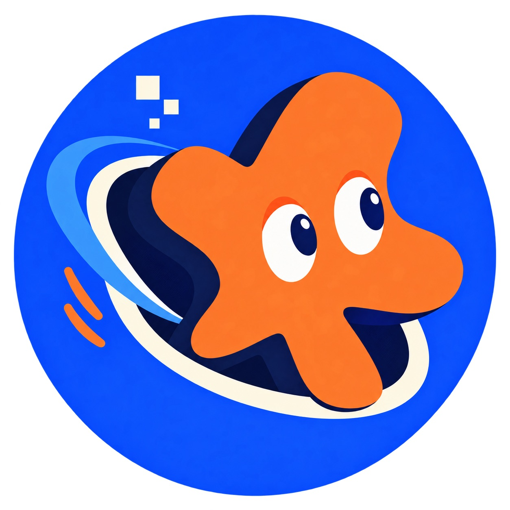

<p align="center">
  
</p>

<h1 align="center">OpenAIGames</h1>

<p align="center">Make something worth playing.</p>

<p align="center">
  <a href="https://openaigames.org/?lang=en">Enter the room</a> ·
  <a href="https://openaigames.org/?lang=en#/submit">Submit a game</a> ·
  <a href="https://github.com/openaigames/community">Join the community</a>
</p>

<p align="center"><a href="README.md">简体中文</a> · English</p>

OpenAIGames is a community for making games, playing them, and exploring AI creation tools and workflows together. This repository contains the community website: a 3D game room where you can pick a cartridge, try a project, and share feedback.

## Come play

- **Pick a cartridge:** featured games on the left, community playtests on the right, and a searchable catalog.
- **Play fullscreen:** open a game, leave feedback, and return to the same session.
- **Share your thoughts:** sign in with GitHub to rate, like, and comment.
- **Explore the room:** listen to music, leave a wish, or learn how to contribute. Chinese, English, and mobile interactions are supported.

## Take part

| What you want to do | Where to start |
| --- | --- |
| Share a playable project | [Quick submission](https://openaigames.org/?lang=en#/submit); approved entries appear as community playtests |
| Contribute project metadata through a PR | [Community submission guide](https://github.com/openaigames/community/blob/main/docs/GAME_SUBMISSION.md) |
| Make games or build tools and pipelines together | [Community repository](https://github.com/openaigames/community) |
| Improve the website or report a problem | [Open an issue](https://github.com/openaigames/website/issues) or submit a PR here |

Project submissions live in `community`. Website interfaces, interactions, and server code live in `website`.

## Run locally

Use Node.js 22 or a newer supported version.

```sh
npm ci
npm run build
npm run db:local
npm run dev
```

Open [localhost:8499](http://127.0.0.1:8499/). Run `npm run build` again after editing source files; run `npm test` for automated checks. Local development uses the included game catalog and a local database for messages and submissions.

Built with **Three.js · Cloudflare Workers · D1**. See [development documentation](docs/DEVELOPMENT.md) for authentication, moderation, and deployment setup.

## Documentation

| Document | Covers |
| --- | --- |
| [Development and deployment](docs/DEVELOPMENT.md) | Local setup, releases, catalog publishing, and i18n |
| [Room interactions](docs/ROOM.md) | Camera, touch controls, fullscreen play, feedback, and music |
| [Sign-in and moderation](docs/AUTH_AND_MODERATION.md) | GitHub authentication, submission review, and authorization |
| [Analytics](docs/ANALYTICS.md) | Page views, estimated visitors, game opens, and metric definitions |

Administrators use the [review desk](https://openaigames.org/admin) to moderate submissions and view analytics. Admin source code is included here; access is enforced by the server. Secrets, sessions, and user data are never published with the source.

## License

Original website code is released under the [MIT License](LICENSE). Third-party games, artwork, fonts, and dependencies retain their own licenses; see [Third-party notices](THIRD_PARTY_NOTICES.md).
